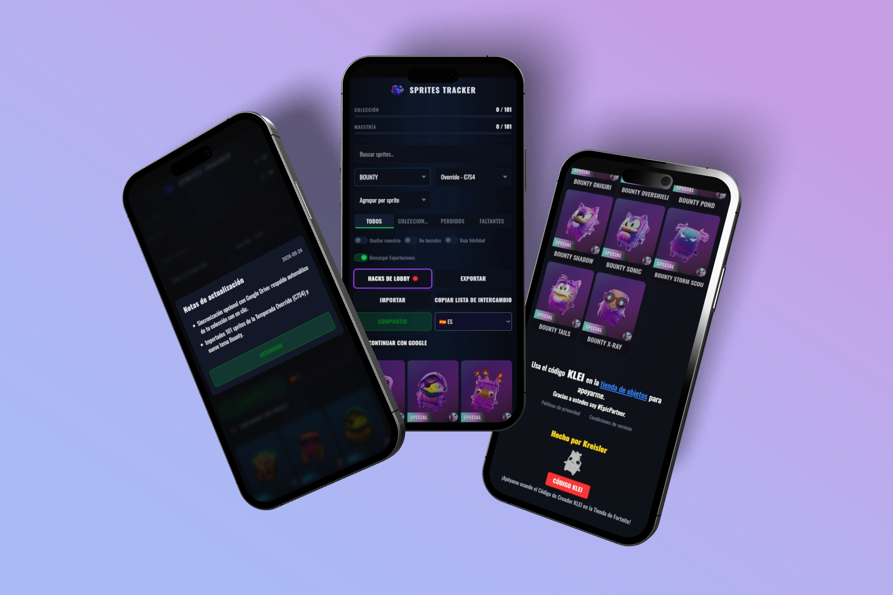
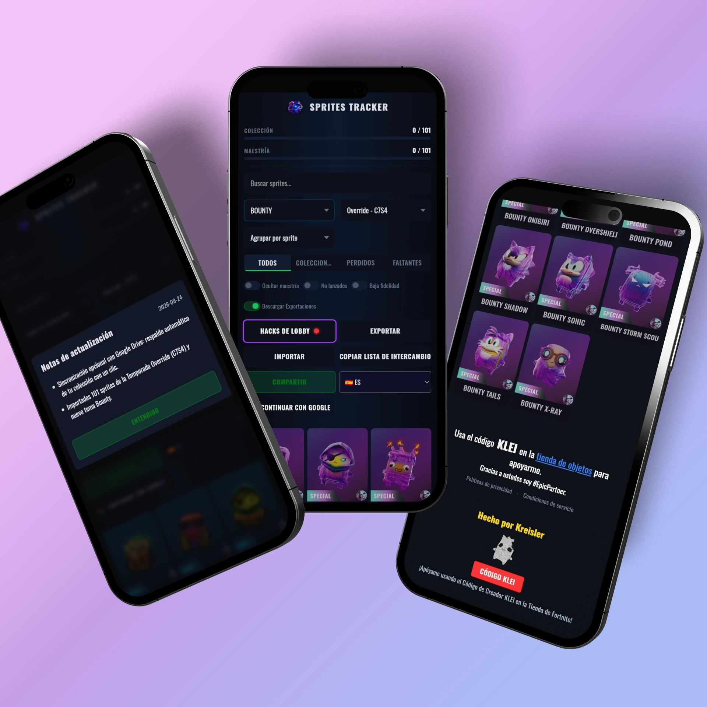
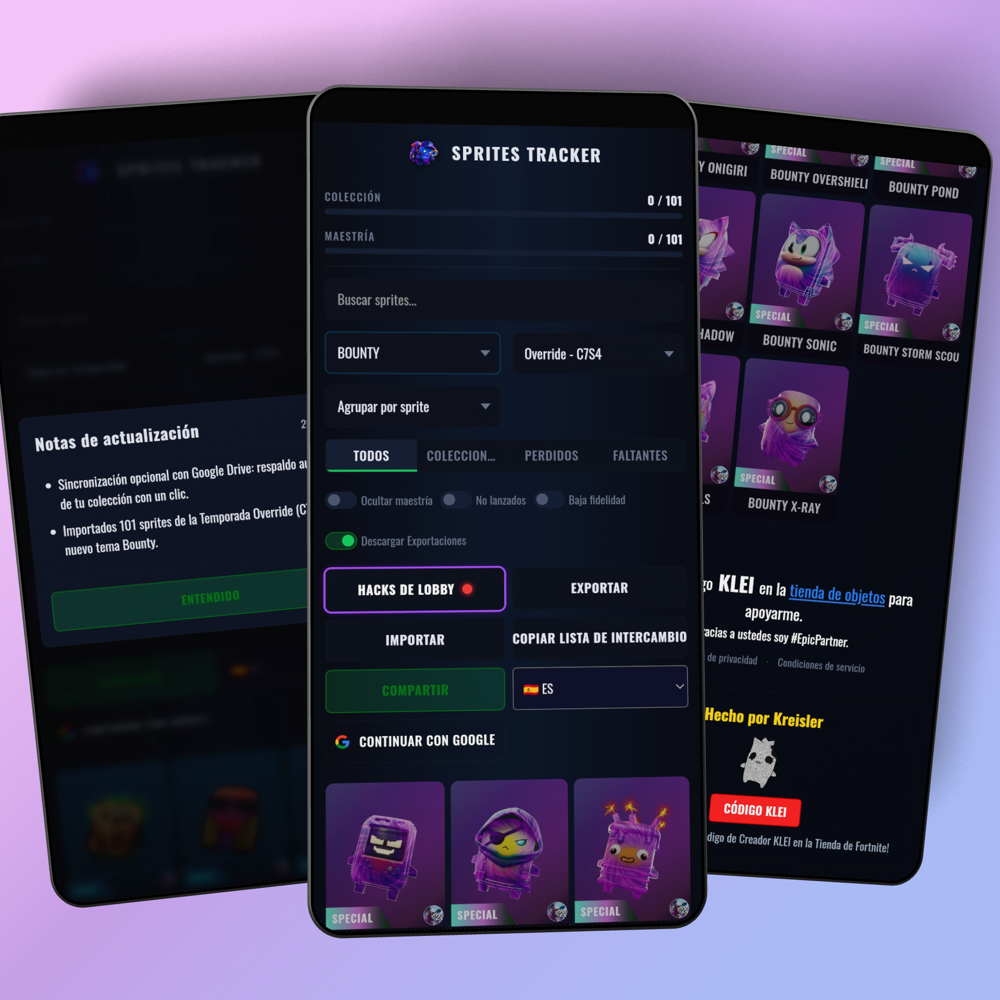

# Sprites Tracker

Track, manage, and share your **Fortnite Sprites** collection and mastery progress.

🔗 **Live site:** https://itskreisler.github.io/fnsprites/

## Preview

## Features

### Compared to the [original tracker](https://github.com/staticvacant/fnsprites)

| Feature | Original | This fork |
|---|---|---|
| Collection tracking (obtained / mastered) | ✅ | ✅ |
| Export PNG images | ✅ | ✅ |
| Backup & import (JSON) | ✅ | ✅ |
| Share links | ✅ | ✅ |
| Trade list copy | ✅ | ✅ |
| Lobby hacks / codes page | ✅ | ✅ |
| **Multi-language (ES / EN / DE)** | ❌ | ✅ |
| **Lost sprites tracking** | ❌ | ✅ |
| **Lost status filter** | ❌ | ✅ |
| **Mark-as-lost button (💔)** | ❌ | ✅ |
| **Season filter (no freeze)** | ✅ | ✅ (optimized) |

### Multi-language

Switch between **Spanish**, **English**, and **German** from the language selector in the toolbar. The language preference is saved locally.

### Lost sprites

In Fortnite, you can lose collected sprites and revive them later with Stardust. The **Lost** status lets you track sprites that are still in your collection but currently inactive — so you know exactly which ones to revive.

- Click the **💔** button on an obtained/mastered sprite to mark it as lost
- Click a **lost** sprite to revive it back to obtained
- Lost sprites count toward your collection progress
- Filter by **Lost** to see only inactive sprites

## Credits

This project is a fork. It would not exist without the original tracker.

- **[staticvacant](https://github.com/staticvacant/fnsprites)** — original
  tracker, created by staticvacant. All credit for the original work.
- **Kreisler** — i18n, lost sprites feature, branding, image export rework,
  Google Drive sync, accessibility, deployment
- **Vero** — feature idea: lost sprites system & German language request

The original repository was published without a license file, so its author
granted no license for its contents. This fork asks that author's permission
before redistributing the derived portions, and is not able to relicense them
under the MIT license below. See [`NOTICE`](NOTICE) for the full details.

Sprite data and images come from [Rick's Tracker](https://rickventure.com) and,
where needed, [fortnite.gg](https://fortnite.gg/sprites).

## License

The original contributions in this fork are released under the
[MIT License](LICENSE). Derived portions are excluded — see [`NOTICE`](NOTICE).

Fan project. Not affiliated with, endorsed by or sponsored by Epic Games.
*Fortnite* and all related trademarks and game assets belong to Epic Games.
